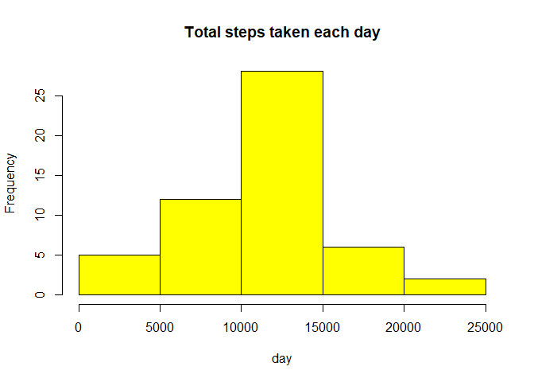
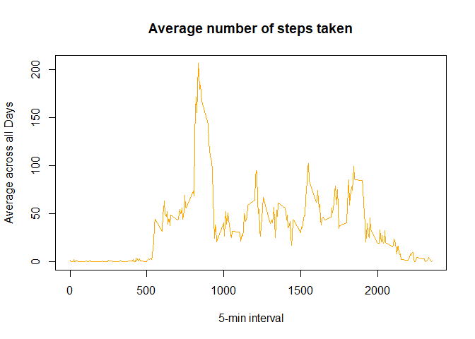
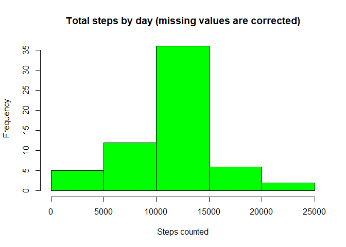
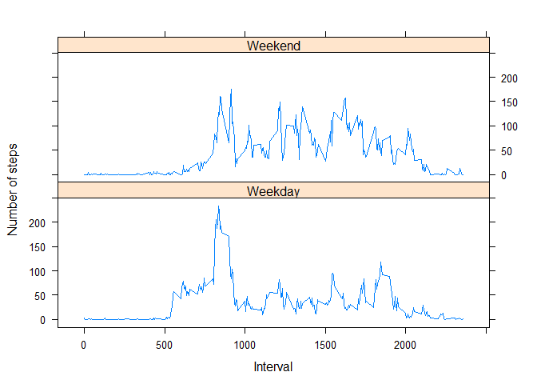

# Reproducible Research: Peer Assessment 1

## Loading and preprocessing the data
####Loading R packages

```r
library("plyr")
library("knitr")
library("reshape2")
library("ggplot2")
library("lattice")
knitr::opts_chunk$set(echo = TRUE)
```

####Unzipping and loading data

```r
unzip(zipfile="activity.zip")
activity <- read.csv("activity.csv", colClasses = c("numeric", "character", "numeric"))
activity$date <- as.Date(activity$date, "%Y-%m-%d")
```

## Histogram of the total number of steps taken each day

```r
StepsTotal <- aggregate(steps ~ date, data = activity, sum, na.rm = TRUE)
hist(StepsTotal$steps, main = "Total steps taken each day", xlab = "day", col = "yellow")
```

<!-- -->

##Mean and median number of steps taken each day

```r
meanSteps <- mean(na.omit(StepsTotal$steps))
meanSteps <- as.integer(meanSteps)
medianSteps <- median(na.omit(StepsTotal$steps))
medianSteps <- as.integer(medianSteps)
```
###Answer: The mean is 10766 and the median is 10765

##Time series plot of the average number of steps taken

```r
time_series <- tapply(activity$steps, activity$interval, mean, na.rm = TRUE)
plot(row.names(time_series), time_series, type = "l", xlab = "5-min interval", 
    ylab = "Average across all Days", main = "Average number of steps taken", 
    col = "orange")
```

<!-- -->

##The 5-minute interval that, on average, contains the maximum number of steps

```r
max_interval <- which.max(time_series)
names(max_interval)
```

```
## [1] "835"
```
###Answer: The one starting at 8:35AM

##Code to describe and show a strategy for imputing missing data

```r
activity_NA <- sum(is.na(activity))
activity_NA
```

```
## [1] 2304
```

```r
StepsAverage <- aggregate(steps ~ interval, data = activity, FUN = mean)
fillNA <- numeric()
for (i in 1:nrow(activity)) {
    obs <- activity[i, ]
    if (is.na(obs$steps)) {
        steps <- subset(StepsAverage, interval == obs$interval)$steps
    } else {
        steps <- obs$steps
    }
    fillNA <- c(fillNA, steps)
}
modified_activity <- activity
modified_activity$steps <- fillNA
```

##Histogram of the total number of steps taken each day after missing values are imputed

```r
ModifiedStepsTotal <- aggregate(steps ~ date, data = modified_activity, sum, na.rm = TRUE)
hist(ModifiedStepsTotal$steps, main = "Total steps by day (missing values are corrected)", xlab = "Steps counted", col = "green")
```

<!-- -->

##Panel plot comparing the average number of steps taken per 5-minute interval across weekdays and weekends

```r
day <- weekdays(activity$date)
daylevel <- vector()
for (i in 1:nrow(activity)) {
    if (day[i] == "Saturday") {
        daylevel[i] <- "Weekend"
    } else if (day[i] == "Sunday") {
        daylevel[i] <- "Weekend"
    } else {
        daylevel[i] <- "Weekday"
    }
}
activity$daylevel <- daylevel
activity$daylevel <- factor(activity$daylevel)
```


###Answer: Yes, there is significant difference, weekend steps counted are remarkably higher

```r
stepsByDay <- aggregate(steps ~ interval + daylevel, data = activity, mean)
names(stepsByDay) <- c("interval", "daylevel", "steps")
xyplot(steps ~ interval | daylevel, stepsByDay, type = "l", layout = c(1, 2), 
    xlab = "Interval", ylab = "Number of steps")
```

<!-- -->
